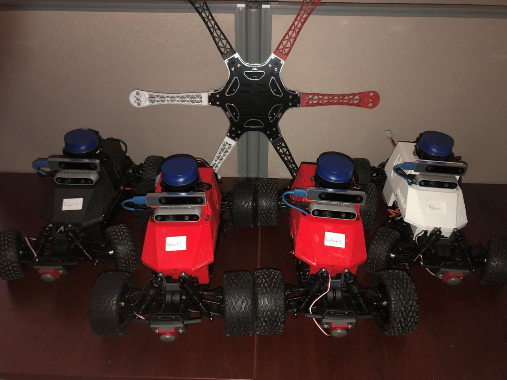

# AirOU Race Cars (ARC)

Regarding hardware and software information for the ARC system, most information and tutorials can be found on the [MuSHR website](https://mushr.io/) which is the project ARC is derived from.

For any questions or concerns, feel free to reach out to us at:

**tyler.m.roman-1@ou.edu (Software) and dvargas88@ou.edu (Hardware & MiniCity)**.

There is also a forum for MuSHR issues located in their [GitHub organization discussions](https://github.com/prl-mushr/mushr/discussions).

## Outside Resources

Regarding the software for the MuSHR/ARC system, most information and tutorials can be found on the MuSHR website

Links to an external site. 

For any questions or concerns, feel free to reach out to Tyler Roman at tyler.m.roman-1@ou.edu. There is also a forum for MuSHR issues located in their GitHub organization discussions

Links to an external site..  

We recommend at least going through the following tutorials: 

[Quickstart (Legacy)](https://mushr.io/tutorials/quickstart/): This will go over getting the MuSHR repo and running the MuSHR simulation. 

[Intro to ROS](https://mushr.io/tutorials/intro-to-ros/): As well as providing some basic insight into how ROS works, it also goes over how to create a package and subscribe to and publish to ROS topics in the MuSHR system 

[General System Overview](https://mushr.io/tutorials/overview/): Details on the hardware and ROS topics (I highlight key takeaways in the next section) 

For the purposes of documentation, we will only go over methods and information relevant to running the base sensors in ARC system, and anything that might be of resource to a new user 
