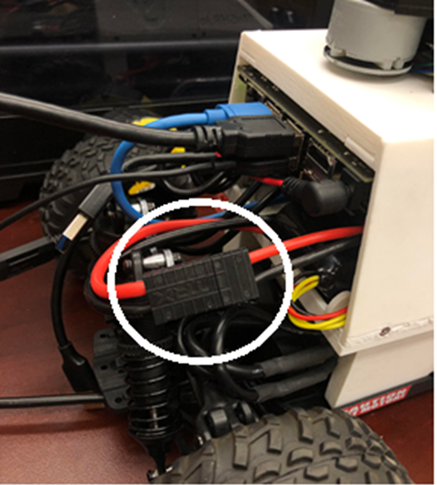
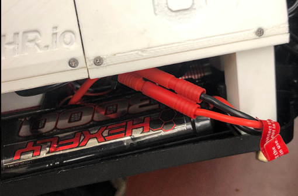
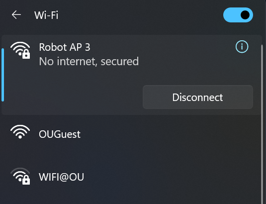
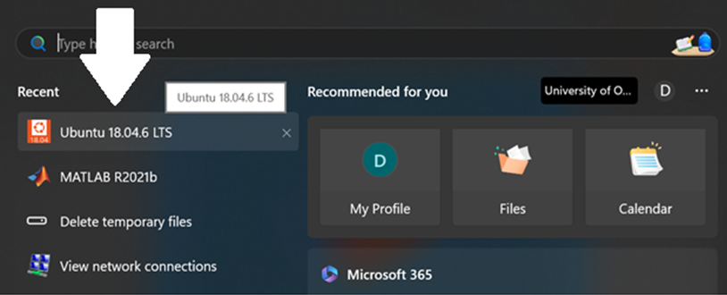
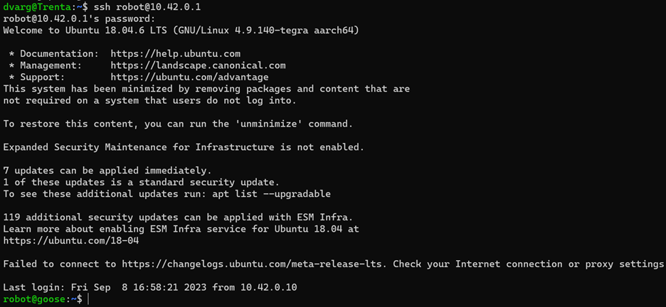
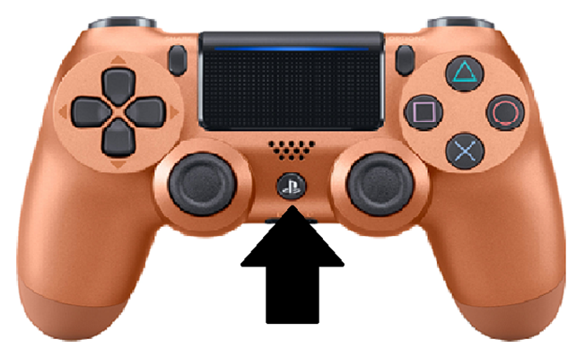

# Initial Boot-up
## Introduction
In this tutorial, we will show how to run the robot in teleoperation mode.
This involves plugging in the batteries, connecting to the robot's network, and launching the teleoperation ROS launch file.

## Steps

1. **Plugin The Main Battery:**

2. **Plugin The VESC Battery:**

(Front wheels should “lock” when VESC is plugged in) 

3. **Connect to Robot Wi-Fi Network:**

Connect to the network named "Robot AP ***robot number***" (Example: Robot AP 3)

> NOTE:
> 
> It may take up to 30 seconds for the network to appear as a possible connetion 

4. **SSH Into The Car:**
If using WSL, open the Ubuntu 18.04 Terminal
* [Here's how to download UBuntu if you're using Windows](../misc/wslInstall.md)

Or if you're already using a linux OS, just open the bash terminal

In the terminal, enter the command: 

    ssh robot@10.42.0.1 

You should see something like this:

5. **Connecting The Bluetooth Controller:**

Press the center button on the PS4 controller to pair
* If it does not connect, [see here](../misc/bluetoothController.md)

6. **Starting Teleoperation:**

To start teleoperation and drive the car manually with the sensors active, enter:

    roslaunch mushr_base teleop.launch

After awhile (like 15-20 seconds), you should see the the sensors turn on (LiDAR and realsense cameras) and be able to drive it manually.
* While holding the Deadman's Switch (L1), you can use the left joystick to go forward and backward and the right joystic to steer left or right.
