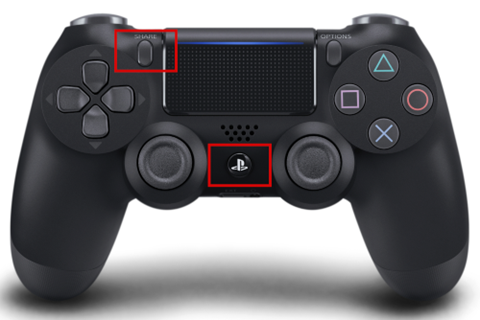
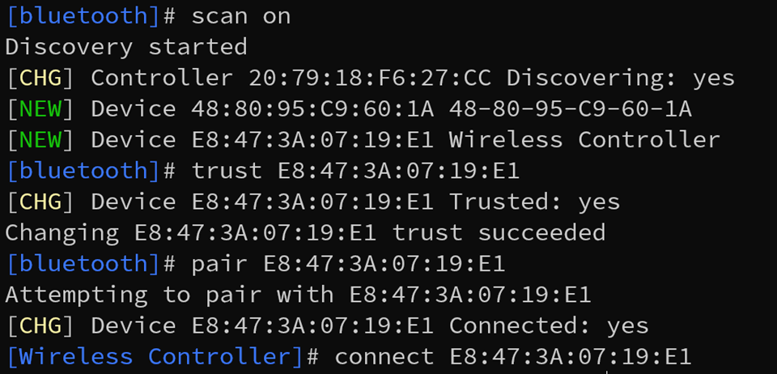

# Pairing Bluetooth Controller

## Introduction 
Throughout development, the Bluetooth controllers have been notorious for not connecting to the ARC. If you encounter any troubles, here’s the simplest and fastest way to reconnect the Bluetooth controller. 

## Steps:

1. Connect to the robot Wi-Fi and SSH into the robot (see [Initial Boot-Up](../hardware/initial.md)) 

Next run, the command: 

    bluetoothctl 

> Bluetoothctl is a terminal program that can be used to trust, pair, and connect Bluetooth devices. 

Upon running bluetoothctl, you should see a list of currently connect devices
Run the following command to search for available connections:

    scan on
 

2. Put the Bluetooth controller into pairing mode 

Press and hold the PS button and the Share button at the same time until the light bar starts flashing in pairing mode:

 

3. Trust, pair, and connect to the Bluetooth controller. 

Once you've run ```scan on``` you should see a list of devices appear in the terminal.
When you see "Wireless Controller", copy the MAC addresss and enter:
    
    trust <MAC Address>
    connect <MAC Address>

Example:

 

After doing such, the light bar should stop flashing and remain a constant white, blue, or purple color at which point the device is connected. 

> NOTE: 
> 
> If you have any errors, try waiting for the controller to leave pairing mode and then try just pressing the PS button. There’s a chance the device is trusted and ready to be connected but couldn’t do so. 


