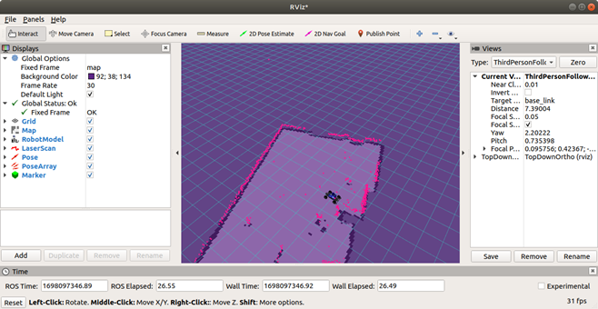

# Initial Software & Simulation

## Introduction
In this tutorial, we’ll go over the bare necessities you’ll need on your base computer to run the simulation stack. By doing so, you’ll also have access to the utilities for the project like the default RVIZ configuration file. 

**Perquisites:**

* Ubuntu 18.04 dual booted on your machine or Ubuntu 18.04 installed on WSL2 on your Windows Computer.  
    * **Note:** Instructions to [Install WSL2](../misc/wslInstall.md)

    * **Note:** WSL1 will be more difficult to use since you have to [setup graphics rendering](https://ripon-banik.medium.com/run-x-display-from-wsl-f94791795376).

* Python2.7
    * **Note:** This should be the default version for Ubuntu 18

* [ROS Melodic Desktop Full](http://wiki.ros.org/melodic/Installation/Ubuntu)

## Steps
1. **Create a catkin_ws directory**

This will create a workspace to house all the code, including the simulations, on your computer. Open your terminal and copy these commands: 

    mkdir ~/catkin_ws/src 

    cd ~/catkin_ws && catkin_make 

    echo ~/catkin_ws/devel/setup.bash >> ~/.bashrc 

    source ~/.bashrc 

2. **Install dependencies**

Before we can copy the code base, we need to make sure that we have some dependencies. Copy and paste these commands into your terminal. 

*Make sure you have ROS Melodic installed!*

    sudo apt install git-all  

    sudo apt install python-tk 

    curl -s https://packagecloud.io/install/repositories/dirk-thomas/vcstool/script.deb.sh | sudo bash 
    sudo apt-get update 
    sudo apt-get install python3-vcstool 

3. **Ensure we have ROS dependencies**

To run the codebase, we need to ensure that we have the proper ROS messages. To install them, copy and paste this into your terminal: 

    sudo apt install -y ros-melodic-ackermann-msgs ros-melodic-map-server ros-melodic-serial ros-melodic-urg-node ros-melodic-robot-state-publisher ros-melodic-xacro 

4. **Install Necessary repositories**

From our github repo, download repos.yaml into ~/catkin_ws/src 

Then run:  

    vcs import < repos.yaml 

5. **Install rangelibc:**

Rangelibc is a python library used for different implementations of raycasting for 2D occupancy grids. 

Install by running the following commands: 

    cd ~/catkin_ws/src/range_libc/pywrapper 

    sudo python setup.py install 

    cd ~/catkin_ws/src && rm -rf range_libc 

6. **Run catkin_make to build everything**

    cd ~/catkin_ws && catkin_make 

Then you’ll want to source the workspace environment, so it's added to your path 

    echo 'source /opt/ros/melodic/setup.bash' >> ~/.bashrc 
    echo 'source ~/catkin_ws/devel/setup.bash' >> ~/.bashrc 
    source ~/.bashrc 

7. **Change the default rviz configuration**
    
```
cp ~/catkin_ws/src/mushr/mushr_utils/rviz/default.rviz ~/.rviz/
```

7. **Running the simulation**

In one terminal, launch teleoperation: 

    roslaunch mushr_sim teleop.launch 

In another terminal, launch rviz: 

    rviz 

You should now see the simulation for the ARC system. 


