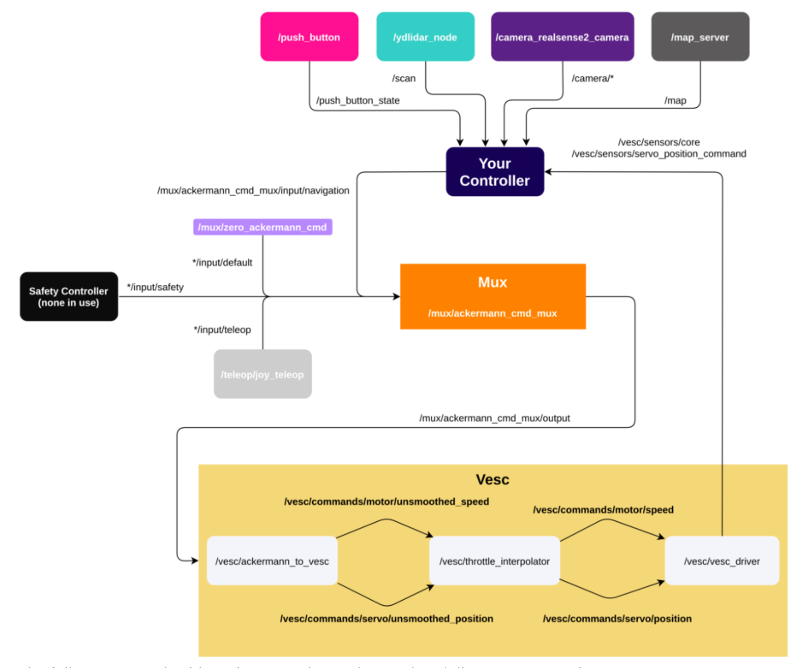

# System Overview

The main takeaway from this diagram should be that creating your own controller (catkin package) is as simple as subscribing to sensor nodes and publishing to Mux 

> **NOTE:**
> 
> For the Ackermann steering commands, there are 4 levels: 
> * Safety
> * teleop 
> * navigation
> * default
> 
> Autonomous drive messages should be published to **/car/mux/ackermann_cmd_mux/input/navigation**

 

## Notable Packages:
***(Bullet indentations represent depth in file structure)***

**mushr_sim:** Contains scripts for the simulation 

**mushr_base:** Ties all other packages together 

**mushr_hardware:** Contains launchfiles for running the car and contains the sensor packages 

* **ylidar:** Contains scripts and launch files for interfacing with the 2D lidar 

* **realsense:** Contains scripts and launch files for interfacing with realsense camera sensors (d435i and t265)

* **Vesc:** Contains scripts for interfacing with the vesc 

