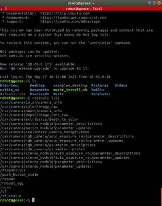
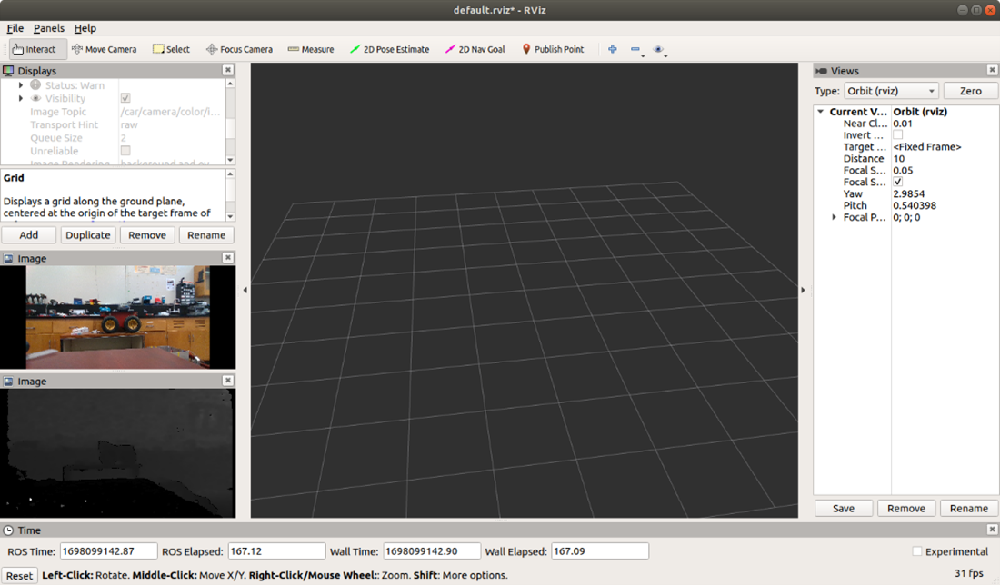
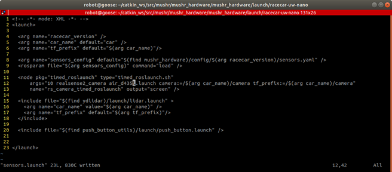

# Running The Sensors
## Introduction
The sensor launch file used in teleoperation can be found in mushr_hardware. 

In this section, I’ll go over how to launch the sensors - both independently and all at the same time - in the scenario where you do not want to enable teleoperation and would just like to configure sensor data. 

## Steps: 

1. **SSH Into Robot**

After turning on the robot and connecting to the WiFi, we first need to SSH into the robot.

From your base computer run: 

    ssh robot@10.42.0.1 

2. **Navigate to the mushr_hardware directory**

The launch file that is executed during teleoperation is located in the mushr_hardware package. To get to the launch file, run the follwing commands: 

    roscd mushr_hardware && cd launch/racecar-uw-nano  

3. **Run sensors.launch**

Run the following command:  

    roslaunch sensors.launch racecar_version:=racecar-uw-nano 

From a separate terminal (either in your base computer or SSH’d into the robot) run: 

    rostopic list 

And you should see a series of topics relating to the sensors. 

 

> **Note on Sensor topics:**
>
> To get any information from the depth camera, look at the topics that contain ../camera/.. 
>
> * such as ../camera/depth/image_raw and ../camera/color/image_raw which contains depth information and rgb color data, respectively, for the captured frame. 

Now if you were to open RVIZ from your base computer, you should see a list of topics that you can add which relate to the sensors onboard the robot 

> **Note on Sensors in RVIZ:**
>
> You may not be able to visualize the LiDAR information; in the example below, I show the rgb and depth information from the depth camera. 



## Explaining sensors.launch 

With your text editor of choice, open sensors.launch  located in .../mushr_hardware/launch/racecar-uw-nano/: 


 

**Lines 4-6:** we define variables for the roslaunch file

* ***racecar_version:*** For our purposes this will always be racecar-uw-nano and this used to refer to files relating to this version of the car 

* ***car_name and tf_prefix:*** This is used to prefix the topic names. You would only want to specify this if you are working with multiple cars and need to differentiate between sensors and topics 

**Line 8-9:** load a sensors configuration file specific to our racecar version 

**Lines 11-18:** launch the sensor nodes which result in sensor data being published: 

* **11-14:** Launch the realsense depth camera with a 10 second delay 

* **15-18:** Launch the lidar sensor 

**Line 20:** launches the push_button on the front of the car. As of right now, the push button has no functionality. 

>**Note on single sensor testing:**
>
> If you want to just launch one sensor, you can refer to the hardware ROS packages.
>
> For the realsense d435i camera, we run the command: 
>
>   ```roslaunch realsense2_camera air_d435i.launch ```
>
> For the lidar, we run the command: 
>
>   ```roslaunch ydlidar lidar.launch```
>
> For the t265 tracking camera, we run the command: 
>
>   ```roslaunch realsense2_camera rs_t254.launch```
