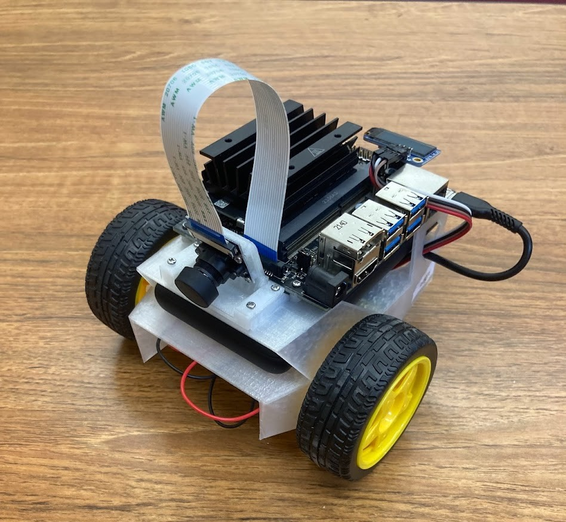

# JetBot

## Overview

A set of 10 Jetbots have been constructed using [Nvidia's guide](https://jetbot.org/master/getting_started.html). They have been flashed with the base JetBot image.

For software questions, contact Matthew Carroll ([matthewcarroll@ou.edu](mailto:matthewcarroll@ou.edu)).

For hardware questions, contact Phong Nguyen ([phong.t.nguyen-1@ou.edu](mailto:phong.t.nguyen-1@ou.edu)).

## CS 5013 - Artificial Intelligence

For the Final Project of CS 5013 in Spring 2024 at the University of Oklahoma, graduate students will utilize this hardware plaform to implement a machine learning algorihtm on their JetBot. They will utilize computer vision to navigate the JetBot via its wide-angle camera.

For setup instructions for students of CS 5013, continue to [Setup](setup.html).
