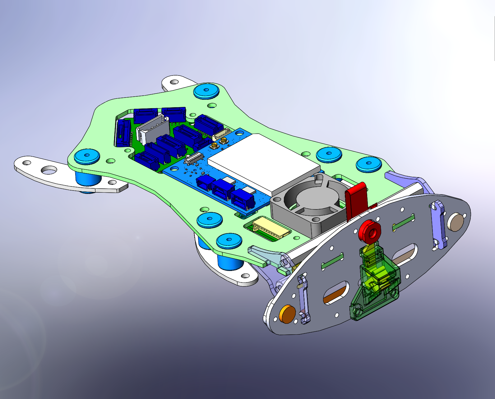

# VOXL Flight Deck

We use an all-in-one dev kit provided by ModalAI called the [VOXL Flight Deck](https://docs.modalai.com/flight-deck/).

The main board is the [Voxl-Flight](https://docs.modalai.com/voxl-flight/) which contains 2 modules working in tandum:
* VOXL:
	* Android Flight Computer
	* Wi-Fi Modem + Radio
* Flight Core:
	* Flight controller running PX4 firmware

The Flight Deck package also includes several other components which are useful:
* Green resin frame
	* Vibration dampers
	* Cooling fan
* 4 Cameras
	* [Stereo Cameras](https://docs.modalai.com/M0015/)
	* [Hi-Res Camera](https://docs.modalai.com/M0025/)
	* [Tracking Camera](https://docs.modalai.com/M0014/)
* Power module ([Power Module Kit v2](https://docs.modalai.com/power-module-v2-datasheet/))
* PWM Breakout Kit (M0022 board and [MCBL-00004 cable](https://docs.modalai.com/cable-datasheets/#mcbl-00004))