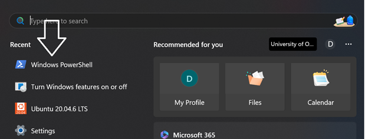
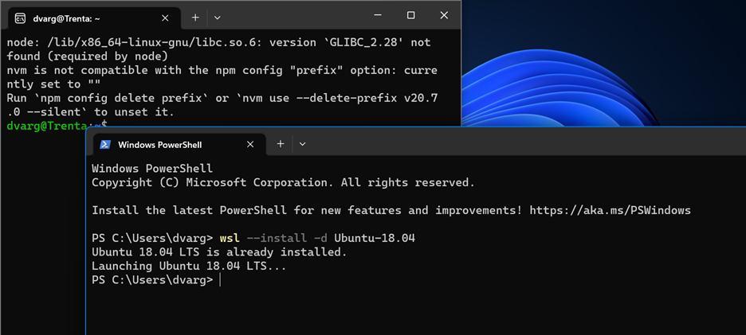

# WSL2 Installation

## Introduction:
To work with most of the robotic system, you need to have ROS installed on your device and to have ROS, you have to have Ubuntu.
In this tutorial, we show you how to install Ubuntu on a Windows device so that one can use ROS melodic.

## Steps
1. **Open Powershell:**
Every Windows operating system comes with PowerShell ready to launch. All you do is open windows PowerShell like the following: 

2. **Install Ubuntu 18.04 for WSL2:**
Next, you will enter the following command: 

    wsl --install -d Ubuntu-18.04 

You will then have Ubuntu 18.04 downloaded onto your computer. Please note this will take a low amount of storage and may take up to 2 minutes.

The following is an example of what will appear after the command is entered. Note that since I have it already downloaded, nothing will change for me.	 

After that, you should restart your computer and then you'll have access the UBuntu terminal.
