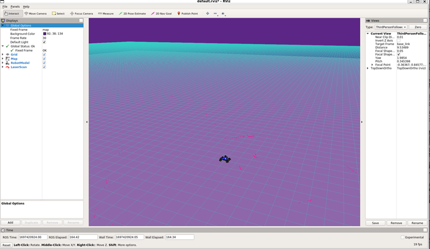
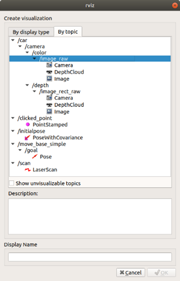
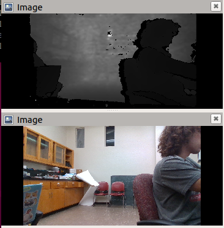

# Using RVIZ
## Introduction
RVIZ is a tool in ROS that can be used to visualize the information coming from the output of your ROS topics. In many cases, this can be a very useful tool for ensuring that the robot's components are working properly. 

In this section, I’ll go over how to visualize information from the LiDAR and real sense camera: 

> Note: Make sure you’ve configured your ROS environment variables in your .bashrc file which allow you to receive information from the MuSHR robot 
> 
> **ROS_MASTER_URI=http://10.42.0.1:11311**
> 
> **ROS_IP=YOUR-IP**

 

## **Steps:**

1. **SSH into the robot and launch teleop.launch in mushr_base**
Launch the following commands: 

```
ssh robot@10.42.0.1 
roslaunch mushr_base teleop.launch
```
At this point, you should see a lot of output on the console detailing the startup process as the sensors turn on and topics start publishing data. 

2. **On your base computer, run RVIZ**

In a separate terminal run:

```
rviz
```

You should now see something like this: 
  

> NOTE: 
> If you do not, see the same type of map as seen in the picture then you may not have the default mushr rviz configuration. In which case, go to [software install setup](initial.md) and make sure to add rviz.default.

3. **Add a topic: Real Sense d435i RGB camera image and depthcloud**

Click on the add button in the bottom left corner. 

This should load a new window which looks like this: 


 

 

You’ll want to select:
* /car/camera/color/image
* /car/camera/dept/DepthCloud
* /car/camera/dept/image 

After which, you should be able to see the camera feed in the bottom left and a depthe cloud originating at the car model: 


This picture shows the depth camera rgb and depth image topics: 


